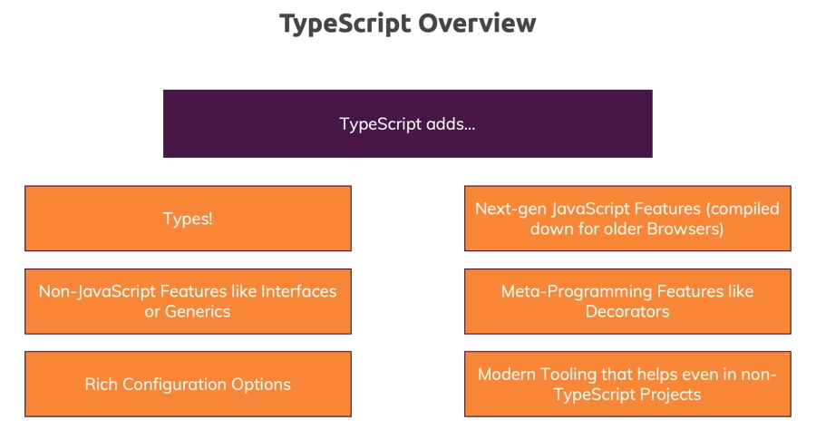

# Getting Started

## What is Typescript

Typescript is a programming language but it's also a tool. It's a powerful compiler which you run over your code to compile your typescript code to JavaScript.

So what you get as a result when writing code in typescript is JavaScript but you didn't write that JavaScript code instead you wrote typescript code with all the new features and all the advantages and you get normal JavaScript code.

Well that of course brings up one important question how can typescript add new features if what you get in the end is regular JavaScript. The answer is the typescript compiler compiles these new features to JavaScript work arounds.

Of course it can't add what's not possible at all in the JavaScript language but it can add new features that simply are easier to use with a nicer syntax.

In addition Typescript of course does one important thing which the name already implies.

It adds **types**. It adds a feature to the JavaScript language which will actually give you as a developer an opportunity of identifying errors in your code before your script runs.

So why would we use typescript? Consider this example, a fairly simple JavaScript function which adds two numbers.

#### HTML

```
    <input type="number" id="num1" placeholder="Number 1" />
    <input type="number" id="num2" placeholder="Number 2" />
    <button>Add!</button>
```

#### JavaScript

```
    const button = document.querySelector("button");
    const input1 = document.getElementById("num1");
    const input2 = document.getElementById("num2");

    function add(num1, num2) {
      return num1 + num2;
    }

    button.addEventListener("click", function() {
      console.log(add(input1.value, input2.value));
    });
```

Notice that we are passing in two strings (_input1.value_, _input2.value_) instead of two numbers. What we would actually get here is probably an unwanted behavior because if you add two strings JavaScript will concatinate the strings instead of doing a mathematical calculation here. Any input from HTML fields will allways be strings.

If we enter 2, 3 as inputs the result would not be 5 but 23, the concatenated string of the two numbers.

This is an error you could have in JavaScript. It's not a technical error. You probably won't get a runtime error but you have a logical mistake in your code and that of course can lead to huge problems in the web applications you're writing with JavaScript.

Now of course in JavaScript we have mitigation strategies.

We could add an `if` check in the function to check the types of the inputs at runtime. We could also validate and sanitise user input.

A simple fix for this would be.

```
    function add(num1, num2) {
      if (typeof(num1) === 'number' && typeof(num1) === 'number') {
        return num1 + num2;
      } else {
        return +num1 + +num2;
      }
    }
```

Wouldn't it be nice if we could catch errors like this during development before we run our code?

Thankfully this is possible with Typescript because developers can write invalid code and introduce bugs like this in JavaScript but with Typescript we have a tool that helps us write better code and avoid such problems.

So let's have a closer look at this.

#### Typescript

```
    const button = document.querySelector("button")!;
    const input1 = document.getElementById("num1")! as HTMLInputElement;
    const input2 = document.getElementById("num2")! as HTMLInputElement;

    function add(num1: number, num2: number) {
      return num1 + num2;
    }

    button.addEventListener("click", function() {
      console.log(add(input1.value, input2.value));
    });
```

**Note:** in the **button** statement we have added an exclamation mark at the end of the statement. This stops a possible null exception error. We know that there will be input values added.

In our Typescript file we get the following error.

> src/using-ts.ts:10:19 - error TS2345: Argument of type 'string' is not assignable to > parameter of type 'number'.
>
> 10 console.log(add(input1.value, input2.value));

`input1.value` and `input2.value` are strings and they are being passed as arguments into the `add()` function which only allows for numbers as input.

Typescript has picked up errors that can be fixed before the program is run.

We can fix these errors by adding a typecasting **+** sign before each input value that casts the input values as numbers and we are now sending numbers as arguments.

```
    console.log(add(+input1.value, +input2.value));
```

This is so much easier than what we were doing to fix the JavaScript code in the previous example.

Now you can run your code in the browser and add sume numbers and then make sure that they are giving you the right sum as output.

### Typescript overview


