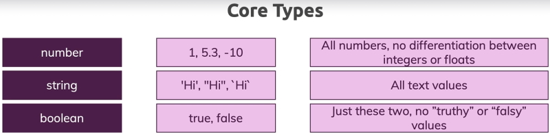
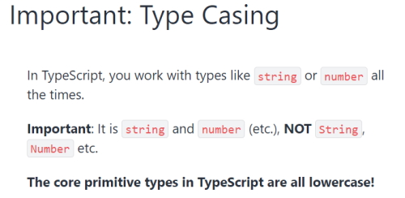
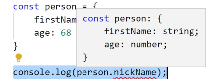
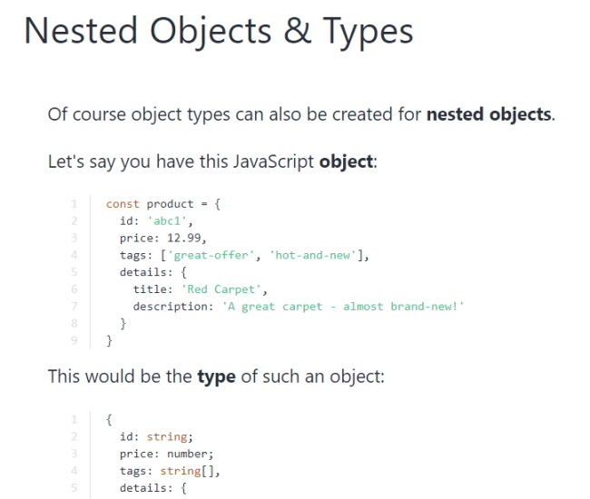
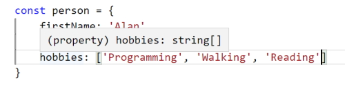
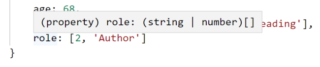

# TypeScript basics & basic types

**Note:** I created a working folder named *TypeScript-basics-&-basic-types* and found that TypeScript wasn't working at all. The **&** really caused problems so I will watch out for this in the future.

## Using types



### Numbers

```
    const add = (n1: number, n2: number) => {
      return n1 + n2;
    }

    const number1 = 5;
    const number2 = 2.8;

    const result = add(number1, number2);
    console.log(result);
```

> 7.8

**Note:** my TypeScript seems to be stricter than the video version. In my case I had to add type assiggnment to the function parameters. If I don't do this I get an error because the type is ``any``.

**Note:** TypeScript's type system only helps you during development (befor you compile). It does not change your runtime code.

## TypeScript types versus JavaScript types

In JavaScript we can add error checking to make sure that the user isn't using values that aren't numbers.

```
    const add = (n1, n2) => {
      if (typeof n1 !== 'number' || typeof n2 !== 'number') {
            throw new Error('Incorrect input...');
      }

      return n1 + n2;
    }
```

This can be avoided if we are using TypeScript and is redundent work. When we are working in JavaScript you are continually using defensive programming like the code above to avoid errors. TypeScript frees us from this burden.

**Note:** TypeScript causes us to fail during development, not at runtime.

Another interesting point is that JavaScript only knows about a small amount of types but Typescript has a lot more types.

## Typecasting



### Booleans

```
    const add = (n1: number, n2: number, showResult: boolean) => {
      if (showResult) {
        console.log(n1 + n2);
      } else {
        return n1 + n2;
      }
    }

    const number1 = 5;
    const number2 = 2.8;
    const printResult = true;

    add(number1, number2, printResult);
```

> 7.8

If we change ``printResult`` to *false* no result will be printed out.

### Strings

```
    const add = (n1: number, n2: number, showResult: boolean, phrase: string) => {
      if (showResult) {
        console.log(phrase + n1 + n2);
      } else {
        return n1 + n2;
      }
    }

    const number1 = 5;
    const number2 = 2.8;
    const printResult = true;
    const phraseString = 'Result is: ';

    add(number1, number2, printResult, phraseString);
```

> Result is: 52.8

**Note:** we have introduced an error into our code and TypeScript doesn't pick up this error.

**Important:** be careful joining different types into a string.

For defensive coding we will have to add.

```
    const add = (n1: number, n2: number, showResult: boolean, phrase: string) => {
      const result = n1 + n2;
      if (showResult) {
        console.log(phrase + result);
      } else {
        return result;
      }
    }
```

> Result is: 7.8

## Type Assignment & Type Inference

In this example we use **type assignment** to specify the parameter types.

```
    const add = (n1: number, n2: number, showResult: boolean, phrase: string) => {
```

Why don't we do this for variable assignment?

```
    const number1 = 5;
    const number2 = 2.8;
    const printResult = true;
    const phraseString = 'Result is: ';
```

In this case we are using **type inference** to infer the types.

``number1`` infers a number and this will never change in typescript.

``printResult`` will always infer a boolean.

``phraseString`` will always infer a string.

We could assign a type to a variable.

```
    let number1: number = 5;
```

This is considered bad programming practice and shouldn't be used.

It could be used to assign a type to a variable that doesn't have avalue.

```
    let number1: number;
```

Later on you would have to give the variable a value and if you don't give it a number it will be an error.

## Object types

Create an object.

```
    const person = {
        firstName: 'Alan',
        age: 68
    }

    console.log(person);
```

> {firstName: "Alan", age: 68}

Works as expected.

If I try to extract a property that doesn't exist I will get an error in TypeScript.

```
    console.log(person.nickName);
```

TypeScript will warn us that the property hasn't been added to the object.

If we hover over the person object we will see this in our intellisense.



This can be confusing. It isn't a JavaScript object as you can see by the semicolons at the end of the properties.

It is an object type inferred by TypeScript. What we are seeing isn't key-value pairs but key-type pairs as inferred by TypeScript.

We can change our code to an object type but when we hover over our ``person`` object in the console statement it inly shows us that it is an object but doesn't show us our properties. This is a generic object and we really want the full details of the object showing.

```
    const person: object = {
        firstName: 'Alan',
        age: 68
    }

    console.log(person);
```

If I put a dot (``.``) after the ``person`` I don't get any intelisense an if I try to add the ``.firstName`` property after ``person`` I will get an error.

We can change this to key-value pairs to describe the type of object.

```
    const person: {
        firstName: string,
        age: number
    } = {
        firstName: 'Alan',
        age: 68
    }

    console.log(person.firstName);
```

> Alan

This will remove the property error and show us the intellisense for the ``person`` object again.

Once again this is not a good practice.

## Nested objects & types



## Array types

```
    const person = {
        firstName: 'Alan',
        age: 68,
        hobbies: ['Programming', 'Walking', 'Reading']
    }

    console.log(person.hobbies);
```

> (3) ["Programming", "Walking", "Reading"]

Once again, if we hover over our hobbies array.



TypeScript describes our data array as a ``string[]`` (array of strings).

I can create a standalone string array.

```
    let favoriteActivities: string[];
```

If I create just a single string for ``favouriteActivites`` it will be an error

```
    let favoriteActivities: string[];

    favoriteActivities = 'Music';
```

We must make an array.

```
    let favoriteActivities: string[];

    favoriteActivities = ['Music', 'Programming'];

    console.log(favoriteActivities);
```

> (2) ["Music", "Programming"]

This also won't work as we have specified an array of strings.

```
    favoriteActivities = ['Music', 'Programming', 1];
```

You could create a mixed array by specifying the ``any`` type.

```
    let jobs: any[];

    jobs = ['Programming', 1];
```

This defeats the purpose of working with TypeScript.

We can also print out the ``person.hobbies`` array collection.

```
    const person = {
        firstName: 'Alan',
        age: 68,
        hobbies: ['Programming', 'Walking', 'Reading']
    }

    person.hobbies.forEach(hobby => {
        console.log(hobby);
    });
```

> Programming       
> Walking       
> Reading

We can also use any string functions on our array of strings.

```
    person.hobbies.forEach(hobby => {
        console.log(hobby.toUpperCase());
    });
```

> PROGRAMMING       
> WALKING       
> READING

## Tuples

TypeScript adds Tuple types to the core types available. A tupe looks like an array but it is different because it is a fixed length array (and fixed type).

```
    const person = {
        firstName: 'Alan',
        age: 68,
        hobbies: ['Programming', 'Walking', 'Reading'],
        role: [2, 'Author']
    }
```

``role`` is a tuple. In this case it always has a number in the first place and a string in the second place. In fact if you hover over ``role`` you will see.



or 

```
    role: (number | string)[]
```

This is a **union** type and we will get into those later.

The key thing is that typeScript sees this as an array that might hold either strings or numbers. The following are also valid;

```
    person.role.push('Admin');
    person.role = ['Writer', 1];
    person.role = ['Writer', 'Reader'];
```

We can make ``role`` into a tuple by specifying the ``person`` object's types.

```
    const person: {
        firstName: string;
        age: number;
        hobbies: string[];
        role: [number, string];
    } = {
        firstName: 'Alan',
        age: 68,
        hobbies: ['Programming', 'Walking', 'Reading'],
        role: [2, 'Author']
    }

    person.role.forEach(item => {
        console.log(item);
    });    
```

> 2     
> Author

Now all of the following will be errors..

```
    person.role.push('Admin'); // error but not shown as an error
    person.role = ['Writer', 1]; // error, wrong position
    person.role = ['Writer', 'Reader']; // error, no number then string
```

The ``push()`` statement won't be seen as an error but at least TypeScript can pick the bottom two errors.

This would be allowed.

```
    person.role = [1, 'Writer'];
```

Tuples are really handy where you want a fixed length array. You can't use these in JavaScript.

## Working with enums

Enums are our first custom type that are added by TypeScript.

```
    enum Role { ADMIN, READ_ONLY, AUTHOR };
```

Note that the enum variable is usually shown with an uppercase for the first letter and all enum values should be uppercase. This is a zero based index.

```
    enum Role { ADMIN, READ_ONLY, AUTHOR };

    const person = {
        firstName: 'Alan',
        age: 68,
        hobbies: ['Programming', 'Walking', 'Reading'],
        role: Role.ADMIN
    }

    if (person.role === Role.ADMIN) {
        console.log('User is an Administrator.');
    }
```

> User is an Administrator.

So an ``enum`` assigns labels to numbers. If you hover over the values in the ``enum`` you will see their number. You can also see this in the compiled JavaScript.

```
    var Role;
    (function (Role) {
        Role[Role["ADMIN"] = 0] = "ADMIN";
        Role[Role["READ_ONLY"] = 1] = "READ_ONLY";
        Role[Role["AUTHOR"] = 2] = "AUTHOR";
    })(Role || (Role = {}));
    ;
    const person = {
        firstName: 'Alan',
        age: 68,
        hobbies: ['Programming', 'Walking', 'Reading'],
        role: Role.ADMIN
    };
    if (person.role === Role.ADMIN) {
        console.log('User is an Administrator.');
    }
```

TypeScript saves us from writing some complex code!

If you don't like the zero based index you can define your own numbering system.

```
    enum Role { ADMIN = 5, READ_ONLY, AUTHOR };
```

Where ADMIN = 5, READ_ONLY = 6 and AUTHOR = 7.

You could also assign your own values to each element in the ``enum``.

If you wanted to you could even assign a name instead of a number.

```
    enum Role { ADMIN = 'ADMIN', READ_ONLY = 'READ_ONLY', AUTHOR = 'AUTHOR' };
```

The standard is the zero based enum.

## The 'any' type

When you use an ``any`` type you can use any value you want. This defeats the purpose of TypeScript and you want to avoid it if you can.

## The Union type

We have a simple function to add a couple of peoples ages.

```
    const combine = (input1: number, input2: number) => {
        const result = input1 + input2;
        return result;
    }

    const combinedAges = combine(36, 24);
    console.log(combinedAges);
```

This isn't exactly what we want and in this case we want to use strings and numbers as input and we actually want to have the option to contactenate two values as well as sum two values.

This is where we could use the ``union`` type.

```
    const combine = (input1: number | string, input2: number | string) => {
        const result = input1 + input2;
        return result;
    }

    const combinedAges = combine(36, 24);
    console.log(combinedAges);

    const combinedNames = combine('Alan', 'Charley');
    console.log(combinedNames);
```

> 60        
> AlanCharley

We get an error in the code on the result statement but it actually works and prints out the results correctly.

We can improve on this code to remove the error.

```
    const combine = (input1: number | string, input2: number | string) => {
        let result;
        if (typeof input1 === 'number' && typeof input2 === 'number') {
            result = input1 + input2;
        } else {
            result = input1.toString() + input2.toString();
        }
        return result;
    }

    const combinedAges = combine(36, 24);
    console.log(combinedAges);

    const combinedNames = combine('Alan', 'Charley');
    console.log(combinedNames);
```

> 60        
> AlanCharley

You won't alway have to use error checking with union types but sometimes you will need to.

Another example of union types is to create an array of mixed types.

```
    const mixed: (string | number | boolean)[] = [];

    mixed.push('Alan');
    mixed.push(27);
    mixed.push(true);

    mixed.forEach(item => {
        console.log(item);
    });
```

> Alan      
> 27        
> true

## Literal types

