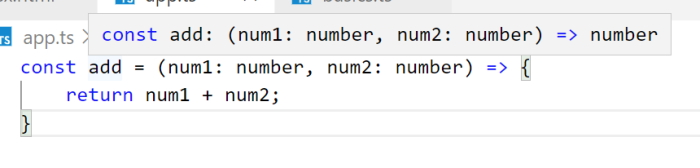
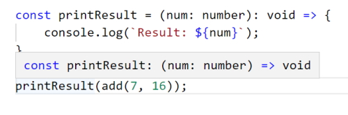
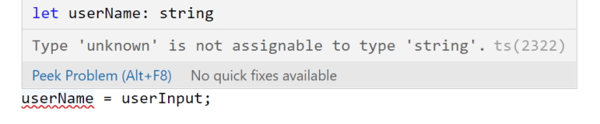

# TypeScript basics & basic types

**Note:** I created a working folder named *TypeScript-basics-&-basic-types* and found that TypeScript wasn't working at all. The **&** really caused problems so I will watch out for this in the future.

## Using types


### Numbers

```
    const add = (n1: number, n2: number) => {
      return n1 + n2;
    }

    const number1 = 5;
    const number2 = 2.8;

    const result = add(number1, number2);
    console.log(result);
```

> 7.8

**Note:** my TypeScript seems to be stricter than the video version. In my case I had to add type assignment to the function parameters. If I don't do this I get an error because the type is ``any``.

**Note:** TypeScript's type system only helps you during development (before you compile). It does not change your runtime code.

## TypeScript types versus JavaScript types

In JavaScript we can add error checking to make sure that the user isn't using values that aren't numbers.

```
    const add = (n1, n2) => {
      if (typeof n1 !== 'number' || typeof n2 !== 'number') {
            throw new Error('Incorrect input...');
      }

      return n1 + n2;
    }
```

This can be avoided if we are using TypeScript and is redundant work. When we are working in JavaScript you are continually using defensive programming like the code above to avoid errors. TypeScript frees us from this burden.

**Note:** TypeScript causes us to fail during development, not at runtime.

Another interesting point is that JavaScript only knows about a small amount of types but Typescript has a lot more types.

## Typecasting


### Booleans

```
    const add = (n1: number, n2: number, showResult: boolean) => {
      if (showResult) {
        console.log(n1 + n2);
      } else {
        return n1 + n2;
      }
    }

    const number1 = 5;
    const number2 = 2.8;
    const printResult = true;

    add(number1, number2, printResult);
```

> 7.8

If we change ``printResult`` to *false* no result will be printed out.

### Strings

```
    const add = (n1: number, n2: number, showResult: boolean, phrase: string) => {
      if (showResult) {
        console.log(phrase + n1 + n2);
      } else {
        return n1 + n2;
      }
    }

    const number1 = 5;
    const number2 = 2.8;
    const printResult = true;
    const phraseString = 'Result is: ';

    add(number1, number2, printResult, phraseString);
```

> Result is: 52.8

**Note:** we have introduced an error into our code and TypeScript doesn't pick up this error.

**Important:** be careful joining different types into a string.

For defensive coding we will have to add.

```
    const add = (n1: number, n2: number, showResult: boolean, phrase: string) => {
      const result = n1 + n2;
      if (showResult) {
        console.log(phrase + result);
      } else {
        return result;
      }
    }
```

> Result is: 7.8

## Type Assignment & Type Inference

In this example we use **type assignment** to specify the parameter types.

```
    const add = (n1: number, n2: number, showResult: boolean, phrase: string) => {
```

Why don't we do this for variable assignment?

```
    const number1 = 5;
    const number2 = 2.8;
    const printResult = true;
    const phraseString = 'Result is: ';
```

In this case we are using **type inference** to infer the types.

``number1`` infers a number and this will never change in typescript.

``printResult`` will always infer a boolean.

``phraseString`` will always infer a string.

We could assign a type to a variable.

```
    let number1: number = 5;
```

This is considered bad programming practice and shouldn't be used.

It could be used to assign a type to a variable that doesn't have a value.

```
    let number1: number;
```

Later on you would have to give the variable a value and if you don't give it a number it will be an error.

## Object types

Create an object.

```
    const person = {
        firstName: 'Alan',
        age: 68
    }

    console.log(person);
```

> {firstName: "Alan", age: 68}

Works as expected.

If I try to extract a property that doesn't exist I will get an error in TypeScript.

```
    console.log(person.nickName);
```

TypeScript will warn us that the property hasn't been added to the object.

If we hover over the person object we will see this in our intellisense.


This can be confusing. It isn't a JavaScript object as you can see by the semicolons at the end of the properties.

It is an object type inferred by TypeScript. What we are seeing isn't key-value pairs but key-type pairs as inferred by TypeScript.

We can change our code to an object type but when we hover over our ``person`` object in the console statement it only shows us that it is an object but doesn't show us our properties. This is a generic object and we really want the full details of the object showing.

```
    const person: object = {
        firstName: 'Alan',
        age: 68
    }

    console.log(person);
```

If I put a dot (``.``) after the ``person`` I don't get any intellisense an if I try to add the ``.firstName`` property after ``person`` I will get an error.

We can change this to key-value pairs to describe the type of object.

```
    const person: {
        firstName: string,
        age: number
    } = {
        firstName: 'Alan',
        age: 68
    }

    console.log(person.firstName);
```

> Alan

This will remove the property error and show us the intellisense for the ``person`` object again.

Once again this is not a good practice.

## Nested objects & types

Of course object types can also be created for nested objects.

Let's say you have this JavaScript object:

```
    const product = {
      id: 'abc1',
      price: 12.99,
      tags: ['great-offer', 'hot-and-new'],
      details: {
        title: 'Red Carpet',
        description: 'A great carpet - almost brand-new!'
      }
    }
```

This would be the type of such an object:

```
let product: {
    id: string,
    price: number,
    tags: string[],
    details: {
      title: string,
      description: string
    }
}
```

So you have an object type nested inside of an object type.

## Array types

```
    const person = {
        firstName: 'Alan',
        age: 68,
        hobbies: ['Programming', 'Walking', 'Reading']
    }

    console.log(person.hobbies);
```

> (3) ["Programming", "Walking", "Reading"]

Once again, if we hover over our hobbies array.


TypeScript describes our data array as a ``string[]`` (array of strings).

I can create a standalone string array.

```
    let favoriteActivities: string[];
```

If I create just a single string for ``favouriteActivites`` it will be an error

```
    let favoriteActivities: string[];

    favoriteActivities = 'Music';
```

We must make an array.

```
    let favoriteActivities: string[];

    favoriteActivities = ['Music', 'Programming'];

    console.log(favoriteActivities);
```

> (2) ["Music", "Programming"]

This also won't work as we have specified an array of strings.

```
    favoriteActivities = ['Music', 'Programming', 1];
```

You could create a mixed array by specifying the ``any`` type.

```
    let jobs: any[];

    jobs = ['Programming', 1];
```

This defeats the purpose of working with TypeScript.

We can also print out the ``person.hobbies`` array collection.

```
    const person = {
        firstName: 'Alan',
        age: 68,
        hobbies: ['Programming', 'Walking', 'Reading']
    }

    person.hobbies.forEach(hobby => {
        console.log(hobby);
    });
```

> Programming       
> Walking       
> Reading

We can also use any string functions on our array of strings.

```
    person.hobbies.forEach(hobby => {
        console.log(hobby.toUpperCase());
    });
```

> PROGRAMMING       
> WALKING       
> READING

## Tuples

TypeScript adds Tuple types to the core types available. A tupe looks like an array but it is different because it is a fixed length array (and fixed type).

```
    const person = {
        firstName: 'Alan',
        age: 68,
        hobbies: ['Programming', 'Walking', 'Reading'],
        role: [2, 'Author']
    }
```

``role`` is a tuple. In this case it always has a number in the first place and a string in the second place. In fact if you hover over ``role`` you will see.


or 

```
    role: (number | string)[]
```

This is a **union** type and we will get into those later.

The key thing is that typeScript sees this as an array that might hold either strings or numbers. The following are also valid;

```
    person.role.push('Admin');
    person.role = ['Writer', 1];
    person.role = ['Writer', 'Reader'];
```

We can make ``role`` into a tuple by specifying the ``person`` object's types.

```
    const person: {
        firstName: string;
        age: number;
        hobbies: string[];
        role: [number, string];
    } = {
        firstName: 'Alan',
        age: 68,
        hobbies: ['Programming', 'Walking', 'Reading'],
        role: [2, 'Author']
    }

    person.role.forEach(item => {
        console.log(item);
    });    
```

> 2     
> Author

Now all of the following will be errors..

```
    person.role.push('Admin'); // error but not shown as an error
    person.role = ['Writer', 1]; // error, wrong position
    person.role = ['Writer', 'Reader']; // error, no number then string
```

The ``push()`` statement won't be seen as an error but at least TypeScript can pick the bottom two errors.

This would be allowed.

```
    person.role = [1, 'Writer'];
```

Tuples are really handy where you want a fixed length array. You can't use these in JavaScript.

## Working with enums

Enums are our first custom type that are added by TypeScript.

```
    enum Role { ADMIN, READ_ONLY, AUTHOR };
```

Note that the enum variable is usually shown with an uppercase for the first letter and all enum values should be uppercase. This is a zero based index.

```
    enum Role { ADMIN, READ_ONLY, AUTHOR };

    const person = {
        firstName: 'Alan',
        age: 68,
        hobbies: ['Programming', 'Walking', 'Reading'],
        role: Role.ADMIN
    }

    if (person.role === Role.ADMIN) {
        console.log('User is an Administrator.');
    }
```

> User is an Administrator.

So an ``enum`` assigns labels to numbers. If you hover over the values in the ``enum`` you will see their number. You can also see this in the compiled JavaScript.

```
    var Role;
    (function (Role) {
        Role[Role["ADMIN"] = 0] = "ADMIN";
        Role[Role["READ_ONLY"] = 1] = "READ_ONLY";
        Role[Role["AUTHOR"] = 2] = "AUTHOR";
    })(Role || (Role = {}));
    ;
    const person = {
        firstName: 'Alan',
        age: 68,
        hobbies: ['Programming', 'Walking', 'Reading'],
        role: Role.ADMIN
    };
    if (person.role === Role.ADMIN) {
        console.log('User is an Administrator.');
    }
```

TypeScript saves us from writing some complex code!

If you don't like the zero based index you can define your own numbering system.

```
    enum Role { ADMIN = 5, READ_ONLY, AUTHOR };
```

Where ADMIN = 5, READ_ONLY = 6 and AUTHOR = 7.

You could also assign your own values to each element in the ``enum``.

If you wanted to you could even assign a name instead of a number.

```
    enum Role { ADMIN = 'ADMIN', READ_ONLY = 'READ_ONLY', AUTHOR = 'AUTHOR' };
```

The standard is the zero based enum.

## The 'any' type

When you use an ``any`` type you can use any value you want. This defeats the purpose of TypeScript and you want to avoid it if you can.

## The Union type

The union type allows us to add one or more types to a variable or array.

In a variable we can set the type where multiple types could be required. In the following example we are saying that the ``uid`` variable can be either a string or number.

```
    let uid: string | number;

    uid = 456;
    uid = '123';

    if (typeof uid !== 'number') {
        uid = +uid;
    }

    console.log(`uid's type is ${typeof uid}.`);
    console.log(`The value is ${uid}.`);
```

> uid's type is number.     
> The value is 123.

**Note:** This gives us some flexibility with types but we have to be careful when using the variable to make sure we cast it to the correct type.

Another example of union types is to create an array of mixed types.

```
    const mixed: (string | number | boolean)[] = [];

    mixed.push('Alan');
    mixed.push(27);
    mixed.push(true);

    mixed.forEach(item => {
        console.log(item);
    });
```

> Alan      
> 27        
> true

In our final example we have a simple function to add a couple of people's ages.

```
    const combine = (input1: number, input2: number) => {
        const result = input1 + input2;
        return result;
    }

    const combinedAges = combine(36, 24);
    console.log(combinedAges);
```

This isn't exactly what we want and in this case we want to use strings and numbers as input and we actually want to have the option to contcatenate two values as well as sum two values.

This is where we could use the ``union`` type.

```
    const combine = (input1: number | string, input2: number | string) => {
        const result = input1 + input2;
        return result;
    }

    const combinedAges = combine(36, 24);
    console.log(combinedAges);

    const combinedNames = combine('Alan', 'Charley');
    console.log(combinedNames);
```

> 60        
> AlanCharley

We get an error in the code on the result statement but it actually works and prints out the results correctly.

We can improve on this code to remove the error.

```
    const combine = (input1: number | string, input2: number | string) => {
        let result;
        if (typeof input1 === 'number' && typeof input2 === 'number') {
            result = input1 + input2;
        } else {
            result = input1.toString() + input2.toString();
        }
        return result;
    }

    const combinedAges = combine(36, 24);
    console.log(combinedAges);

    const combinedNames = combine('Alan', 'Charley');
    console.log(combinedNames);
```

> 60        
> AlanCharley

You won't always have to use error checking with union types but sometimes you will need to.

## Literal types

Union types allow us to set one or more types in an array or variable. We can also use multiple literal types.

A simple example.

```
    type CardinalDirection = | 'North' | 'East' | 'South' | 'West';
    
    function move(distance: number, direction: CardinalDirection) {
        // ...
    }
    
    move(1, 'North'); // okay
    move(1, 'Nurth'); // error
```

Literal types can be used for numbers or strings and are especially useful for strings.

In our ``combine()`` function example above we are expecting a string or number type as our input. We could describe this type by using a third parameter named ``resultConversion`` which we describe as a string so we will set it as a type string.

```
    const combine = (input1: number | string, input2: number | string, resultConversion: string) => {
        let result;
        if (typeof input1 === 'number' && typeof input2 === 'number' || resultConversion === 'as-number') {
            result = +input1 + +input2;
        } else {
            result = input1.toString() + input2.toString();
        }

        return result;
    }

    const combinedAges = combine(36, 24, 'as-number');
    console.log(combinedAges);

    const combinedStringAges = combine('36', '24', 'as-number');
    console.log(combinedStringAges);

    const combinedNames = combine('Alan', 'Charley', 'as-text');
    console.log(combinedNames);
```

> 60        
> 60      
> AlanCharley

This is working as expected and in our arguments we are using either 'as-number' or 'as-text'. If we return anything else as a string literal we will cause problems in the ``if`` test and probably not get the correct result.

We can use TypeScript to force us to use either of the string literals but no other string as input for the third argument.

We can change.

```
    resultConversion: string
```

to a literal type.

```
    resultConversion: 'as-number' | 'as-text'
```

Now, if we enter the following it will be an error.

```
    const combinedStringAges = combine('36', '24', 'as-numb'); // error
```

## Type aliases - Custom types

We can create our own type aliases (``Combinable``).

```
    type Combinable = number | string;

    const combine = (input1: Combinable, input2: Combinable, resultConversion: 'as-number' | 'as-text') => {
```

We can also create custom types (``ConversionDescriptor``).

```
type Combinable = number | string;
type ConversionDescriptor = 'as-number' | 'as-text';

const combine = (input1: Combinable, input2: Combinable, resultConversion: ConversionDescriptor) => {
```

The end result of using type aliases and custom types is that our parameter variables are much cleaner looking and it saves us some typing.

When we compile we end up with the following complicated piece of JavaScript that TypeScript saves us having to create.

#### JavaScript

```
    const combine = (input1, input2, resultConversion) => {
        let result;
        if (typeof input1 === 'number' && typeof input2 === 'number' || resultConversion === 'as-number') {
            result = +input1 + +input2;
        }
        else {
            result = input1.toString() + input2.toString();
        }
        return result;
    };
```

The completed ``combine()`` function.

```
    type Combinable = number | string;
    type ConversionDescriptor = 'as-number' | 'as-text';

    const combine = (input1: Combinable, input2: Combinable, resultConversion: ConversionDescriptor) => {
        let result;
        if (typeof input1 === 'number' && typeof input2 === 'number' || resultConversion === 'as-number') {
            result = +input1 + +input2;
        } else {
            result = input1.toString() + input2.toString();
        }

        return result;
    }

    const combinedAges = combine(36, 24, 'as-number');
    console.log(combinedAges);

    const combinedStringAges = combine('36', '24', 'as-number');
    console.log(combinedStringAges);

    const combinedNames = combine('Alan', 'Charley', 'as-text');
    console.log(combinedNames);
```

## Type Aliases and Object types

Type aliases can be used to create your own types. You are not limited to using union types though - you can also provide an alias to a complex object type.

The following routine is not using type aliases.

```
    const greet = (user: { name: string; age: number }) => {
        console.log('Hi, I am ' + user.name);
    }

    const isOlder = (user: { name: string; age: number }, checkAge: number) => {
        return checkAge <= user.age;
    }

    const u1 = { name: 'James', age: 14 };
    const votingAge = 18;

    greet(u1);

    const ofAge = isOlder(u1, votingAge);

    if (ofAge) {
        console.log(`${u1.name} is of voting age.`);
    } else {
        console.log(`${u1.name} is too young to vote.`);
    }
```

> Hi, I am James        
> James is too young to vote.

We can add type aliases to reduce the amount of typing we do. In the previous example we could have created the following type alias for an object type.

```
    type User = { name: string; age: number };
```

Adding this to the previous example would now look like this.

```
    type User = { name: string; age: number };

    const greet = (user: User) => {
        console.log('Hi, I am ' + user.name);
    }

    const isOlder = (user: User, checkAge: number) => {
        return checkAge <= user.age;
    }

    const u1: User = { name: 'James', age: 14 };
    const votingAge = 18;

    greet(u1);

    const ofAge = isOlder(u1, votingAge);

    if (ofAge) {
        console.log(`${u1.name} is of voting age.`);
    } else {
        console.log(`${u1.name} is too young to vote.`);
    }
```

> Hi, I am James        
> James is too young to vote.

This makes the parameters in both functions look cleaner.

#### Quiz

Will this code make it through compilation?

```
    type User = { name: string } | string;
    let u1: User = {name: 'Max'};
    u1 = 'Michael';
```

> This code is fine. The union type allows either an object (with a "name" property) OR a string. You can switch values how often you want.

## Function Return Types & "void"

If you have a function you can hover over the function name and it will show you the return type.

```
    const add = (num1: number, num2: number) => {
        return num1 + num2;
    }
```

Hovering over the function name produces this message.



So TypeScript infers the return type from the return statement variables.

What if the function doesn't have a return value? TypeScript has a special type that is returned in this case and it is a type of ``void``.

```
    const printResult = (num: number) => {
        console.log(`Result: ${num}`);
    }
```

This function doesn't have a return type and you can actually add a return type to the function if you want. In the case of no return value TypeScript gives us the return type of ``void``.

```
    const printResult = (num: number): void => {
        console.log(`Result: ${num}`);
    }
```

In most cases this isn't necessary because TypeScript infers the type value.

```
    const add = (num1: number, num2: number) => {
        return num1 + num2;
    }

    const printResult = (num: number): void => {
        console.log(`Result: ${num}`);
    }

    printResult(add(7, 16));
```

> Result: 23

If you hover over the ``printResult()`` function you will get a ``void`` return type.



## Functions as Types

In JavaScript we can create a new variable that can take a function.

```
    let combinedValues;

    combinedValues = add;

    console.log(combinedValues(8, 8));
```

``combinedValues`` becomes equal to the function **add()**

So we can run combinedValues to add two numbers together. this works fine but there can be an issue in TypeScript.

```
let combinedValues;

combinedValues = add;
combinedValues = 5;

console.log(combinedValues(8, 8));
```

In some cases this will cause and error in the ``console.log()`` statement. In other cases this won't even produce an error until you run the program in the browser.

This is something we want to guard against and TypeScript can help us by allowing us to cast the ``combinedValues`` variable as a function

```
    let combinedValues: Function;

    combinedValues = add;
    combinedValues = 5;

    console.log(combinedValues(8, 8));
```

Now, *combinedValues = 5;* will show up as an error and if we compiled we would get a compilation error.

There could still be an issue with our code that we need to be aware of.

```
let combinedValues: Function;

combinedValues = add;
combinedValues = printResult;

console.log(combinedValues(8, 8));
```

> undefined

This code is perfectly legal and will compile because ``printResult()`` is a valid function. The problem is that it doesn't have two arguments so will run in the browser and produce an *undefined* result.

It would be good if TypeScript could warn us. This is where function types come into play.

Function types are types that describe a function's parameters and the return value of that function.

```
    let combinedValues: (a: number, b: number) => number;

    combinedValues = add;
    combinedValues = printResult;

    console.log(combinedValues(8, 8));
```

Now ``combinedValues = printResult;`` will produce an error.

TypeScript is saying here that ``combinedValues()`` has to be a function having two number parameters and a number as a return type. The ``add()`` satisfies this criteria.

## Function Types & Callbacks

Functions with callbacks work the same way as function types.

```
    const addAndHandle = (n1: number, n2: number, cb: (num: number) => void) => {
        const result = n1 + n2;

        cb(result);
    }

    addAndHandle(10, 20, (result) => {
        console.log(result);
    });
```

> 30

In the function we are using a callback function as a parameter that has a single parameter and returns a void.

Once we have created our function we can call it and in the callback function we can log the result.

Another interesting fact is that in our function call if we decide to return a value TypeScript will allow this even though we have specified a return type of ``void``.

This is not an error and you will be able to use the return value.

```
    const addAndHandle = (n1: number, n2: number, cb: (num: number) => void) => {
        const result = n1 + n2;

        return cb(result);
    }

    const returnValue = addAndHandle(10, 20, (result) => {
        console.log(result);
        return result;
    });

    console.log(returnValue);
```

> 30        
> 30

#### quiz

Will this code compile?

```
    function sendRequest(data: string, cb: (response: any) => void) {
      // ... sending a request with "data"
      return cb({data: 'Hi there!'});
    }
    
    sendRequest('Send this!', (response) => { 
      console.log(response);
      return true;
    });
```

> Yes, callback functions can return something, even if the argument on which they're passed does NOT expect a returned value.

## The "unknown" Type

```
    let userInput: unknown;
```

It might be unknown because the user doesn't know what type it will be.

The interesting thing is that we can store any type of value and we won't get any errors.

```
let userInput: unknown;

userInput = 5;
userInput = 'Alan';
console.log(userInput);
```

This is the same as not setting a type or if we used the type of ``any`` but ``unknown`` is different.

```
let userInput: unknown;
let userName: string;

userInput = 5;
userInput = 'Alan';

userName = userInput;
```

This will cause an error on the final line of code. We can't let ``userName`` = ``userInput`` because it is of type **unknown**.



If we changed ``userInput`` type to ``any`` the code would work because ``any`` basically says "do whatever you want!".

With ``unknown`` we first have to check the type before we go ahead and try to assign ``userInput`` to unserName``.

This code will work.

```
    if (typeof userInput === 'string') {
        userName = userInput;
        console.log(userName);
    }
```

The interesting thing is that the following won't work.

```
    if (typeof userInput === 'string') {
        userName = userInput;
    }

    console.log(userName); // error
```

the ``console.log()`` statement in this case will fail.

## The "never" Type

Can be used in functions instead of ``void``.

```
    const generateError = (message: string, code: number) => {
        throw { message: message, code: code };
    }

    generateError('An error occurred!', 500);
```

> Uncaught {message: "An error occurred!", code: 500}

This may look abstract but it could be used in large applications where you don't want to manually throw an error but you could pass in a message and code to produce an error message.

If you hover over the function name you will find that it returns the ``never`` type. This function never produces a return value. The ``throw`` call technically causes our script to crash and even if we tried to return a value it wouldn't happen.

You can be clear and explicitly set ``never`` as a return type.

```
    const generateError = (message: string, code: number): never => {
        throw { message: message, code: code };
    }

    generateError('An error occurred!', 500);
```
