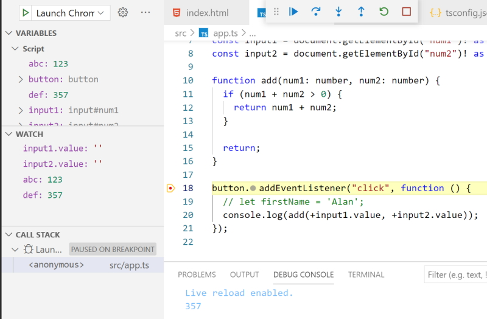

# The TypeScript Compiler

The simple way to compile.

```
    npx tsc app.ts
```

The problem with this is that every time we make a changset to our .ts file we have to run the command again.

## Watch mode

We can use the ``watch`` option to re-compile every time we make a change to our code.

```
    npx tsc app.ts --watch
```

or

```
    npx tsc app.ts -w
```


**Note:** I am running ``npx`` at the start of my commands because my global compiler only uses TypeScript version 1.0.3. By using ``npx`` I can run the locally installed version of TypeScript which is version 4.1.3.


## Compiling the entire project

What if we have a number of TypeScript files in our project?

We can initialise a configuration file for our project with.

```
    npx tsc --init
```

This will create a ``tsconfig.json`` file with our TypeScript configuration options. You only have to run this command once per project.

This will allow us to control and compile all .ts files and we can do this with.

```
    npx tsc -w
```

## Including and Excluding files

We can include and exclude .ts files and folders and we do this after the *compilerOptions* section in ``tsconfig.json``.

```
        },
          "include": ["src"]
    }
```

 have set my **src** folder as the folder that contains my .ts files so only files in this folder will be compiled.

 We could exclude the ``node_modules`` and ``dist`` folders.

 ```
        },
          "exclude": [
              "node_modules", "dist"
        ],
          "include": [
              "src"
        ]
    }
```

**Note:** this is only to show how to exclude folders. The ``node_modules`` folder is automatically ignored anyway. Our include option would also force us to ignore ``node_modules`` anyway.

**Note:** do the excludes first and then the includes as the these options filter down.

You can work with wildcards for files.

```
  "exclude": [
      "node_modules", "dist", "*.dev.ts"
  ]
```

This ignores files with a ``.dev.ts`` extension.

```
  "exclude": [
      "node_modules", "dist", "**/*.dev.ts"
  ]
```

This ignores all ``.dev.ts`` files in **all** folders.

You can ignore folders and just include/exclude files if you want with.

```
  "files": [
      "app.ts", "analytics.ts"
  ]
```

This will now only compile the two files listed above. This would probably only be useful for small projects.

## Setting a Compilation Target

This area in ``tsconfig.json`` allows us to control how our files are compiled.

The most important compiler option would be.

```
    "target": "es6",
```

Initially this is set to ``es5`` and this won't allow new JavaScript options like ``const`` and ``let``. It will change ``const`` and ``let`` in TypeScript down to ``var``.

I have set my target to ``es6``. I am not interested in older browsers that can't handle these keyword types.

## Understanding TypeScript Core Libraries

**lib** can be used to bring in JavaScript libraries. For example when I use the following code.


```
    const button = document.querySelector("button");

    button.addEventListener("click", function () {
        console.log(add(+input1.value, +input2.value));
    });
```

The ``button.addEventListener()`` statement will show an error in TypeScript.

TypesScript isn't sure if there is a button on the HTML page. For now we can work around that by adding an exclamation mark after the ``button`` variable.

```
    const button = document.querySelector("button")!;

    button.addEventListener("click", function () {
        console.log(add(+input1.value, +input2.value));
    });
```

This assures TypeScript that we do have a button on the HTML page. How does TypeScript know how to let us have access to the button? It does this because of the ``lib`` option that is commented out in our ``tsconfig.json`` file at the moment. 

TypeScript assumes some defaults for this setting so you don't have to set them. This is set based on your ``target`` setting. We are using **es6** and this allows for the ``Map()`` object and allows all of the **es6** features that are available in JavaScript including all DOM API's.

We could set the ``lib`` settings manually.

```
  "lib": [
      "dom", 
      "es6",
      "dom.iterable",
      "scripthost"
  ]
```

Actually we don't need to do this because they are the same as the defaults that you get when you set the target for **es6**.

## More Configuration & Compilation Options

```
    "allowJs": true,
    "checkJs": true,
```

These options instruct the TypeScript compiler to include JavaScript files into its processing and then check for compilation errors.

We wouldn't normally use these options. They would be handy if you weren't using TypeScript and wanted to check your JavaScript for errors.

## Working with Source Maps

Source mapping helps us with debugging and development.

```
    "sourceMap": true,
```

Sets the source map on. If you look in your **src** folder you will see and ``app.js.map`` map file. This acts as a bridge between your JavaScript and your browser.

## rootDir and outDir

These configuration settings come in handy when you are running larger projects and allow you to separate files into **src** and **dist** folders.

In our case our TypeScript files will go into the **src** folder and our HTML and CSS files will go into the **dist** folder. Our JavaScript files will go into the **dist/js** folder.

```
    "outDir": "./dist/js",
    "rootDir": "./src",
```

``rootDir`` is where our .ts files are kept and should be compiled.

This combines with our ``include`` option which states that we will only compile .ts files in the **src** folder. All other .ts files in other areas of our project will not be compiled so won't be part of our project.

```
    "include": [
        "src"
      ]
```

Now we have to adjust our HTML file.

```
    <script src="js/app.js" defer></script>
```

### removeComments

The ``"removeComments": true,`` option would be handy as it would remove all comments from your compiled .js files.

#### app.ts

```
    // submit button.
    const button = document.querySelector("button")!;
```

#### app.js

```
    "use strict";
    const button = document.querySelector("button");
```

The comment has been removed in the JavaScript code.

## noEmit

If ``"noEmit": true,`` is set to ``true`` then no JavaScript will be created. This may seem strange but it is handy if you are just writing TypeScript and don't want to generate JavaScript files.

## Stop Emitting Files on Compilation Errors

``"noEmitOnError": true,`` is a useful option that stops creating JavaScript if your TypeScript produces an error.

If we remove the exclamation mark from the following line of code it will create an error.
```
    const button = document.querySelector("button");
```

> src/app.ts:10:1 - error TS2531: Object is possibly 'null'.        
>       
> 10 button.addEventListener("click", function () {

Now if you look in the ``js`` folder you will see that no JavaScript files were created. This will stop you accidently sending out faulty JavaScript code.

## Strict compilation

``"strict": true,`` enables all strict options. It is the same as setting all these options.

> "noImplicitAny": true,        
> "strictNullChecks": true,     
> "strictFunctionTypes": true,      
> "strictBindCallApply": true,      
> "strictPropertyInitialization": true,     
> "noImplicitThis": true,       
> "alwaysStrict": true,

## Code Quality

We can improve code quality by adding these settings

```
    "noUnusedLocals": true,
    "noUnusedParameters": true,
    "noImplicitReturns": true,
```

``noUnusedLocals`` will produce a warning for unused local variables.

```
    button.addEventListener("click", function () {
      let firstName = 'Alan';
    
      console.log(add(+input1.value, +input2.value));
    
    });
```

This will show a yellow underline under the ``firstName`` variable because it isn't being used. If you save it will show an error in TypeScript and not produce JavaScript code. TypeScript will produce an error for warnings as it doesn't know how to handle warnings.

Now if we create an unused global variable TypeScript won't produce a warning because the global variable could be used in another script.

```
    let abc = '123';

    const button = document.querySelector("button")!;
```

The code above will be allowed to run even though the variable ``abc`` isn't being used in this script.

``noImplicitReturns`` will produce a warning if a function doesn't return a value when it is expected to return a value. In the following code we have add a check to see if *num1* + *num2* is greater than 0, if it isn't don't return anything.

```
    function add(num1: number, num2: number) {
      if (num1 + num2 > 0) {
        return num1 + num2;
      }
    }
```

This code won't compile because there is a chance that a return value won't be sent back.

We could fix this code by.

```
    function add(num1: number, num2: number) {
      if (num1 + num2 > 0) {
        return num1 + num2;
      }

      return;
    }
```

## Debugging with Visual Studio Code

You should have the ESLint extension working in your editor.

The Debugger for Chrome extension should also be used. This will allow you to debug with Visual Studio Code and Chrome.

You can start debugging by allowing ``"sourceMap": true`` this will create .ts files in Chrome.

Now Click ``F5`` in VS Code. The first time you run this it will ask you to select your environment and here you will select **Chrome**.

It will now go to a ``launch.json`` file in your .vscode folder. The configurations you will use are.

```
    "configurations": [
            {
                "type": "chrome",
                "request": "launch",
                "name": "Launch Chrome against localhost",
                "url": "http://127.0.0.1:5501/dist/index.html",
                "webRoot": "${workspaceFolder}"
            }
        ]
```

We use the port of 5501 because that is what we are using with Live Server.

Set a breakpoint in your .ts code.

Hit the **F5** key and it will open up a new instance of Chrome. You should now be be ready to debug your code inside of VS Code.

Open up the debug tools menu option and you should be able to set watch variables.

In your console the debug console tab will be open and you can see the ``console.log()`` values you have logged.

Use **F10** to move though your .ts code.

#### Example debug code window


