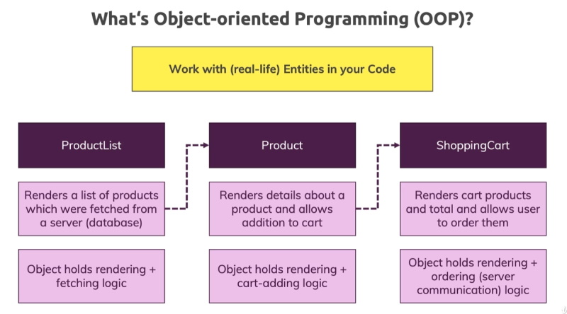
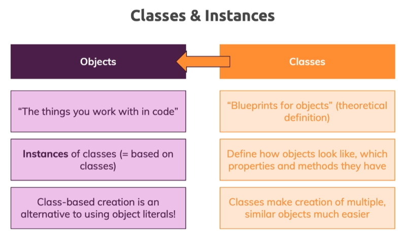

# Classes and Interfaces

Classes are the descriptions of real life entities that we work with every day.



We can create objects from the class blueprint.



Each instance of an object can contain different data but they have the same properties and methods.

## Creating a first class

```
    class Department {
        name: string;

        constructor(n: string) {
            this.name = n;
        }
    }

    const accounting = new Department('Accounting');

    console.log(accounting);
```

> Department {name: "Accounting"}

A constructor is a special method that gets called when an object is initialised. It supplies an initial value to each of the properties in the object.

If we look at the compiled JavaScript it is basically the same as what we created in TypeScript.

#### es6 JavaScript

```
    "use strict";
    class Department {
        constructor(n) {
            this.name = n;
        }
    }
    const accounting = new Department('Accounting');
    console.log(accounting);
    //# sourceMappingURL=app.js.map
```

Now we will change the *tsconfig.json* target to and earlier version of JavaScript, **es5**. And it is totally different. **es5** doesn't have classes so it creates a constructor function as a workaround.

#### es5 JavaScript

```
"use strict";
var Department = (function () {
    function Department(n) {
        this.name = n;
    }
    return Department;
}());
var accounting = new Department('Accounting');
console.log(accounting);
//# sourceMappingURL=app.js.map
```

**es6** developed the idea of classes to create a cleaner version of the object code.

The key point here is that we can create objects with either sets of code. If we down compile to **es5** we can be assured of older browser support.

## Constructor functions & The "this" keyword

We can also add methods to our class definition. In the code below we describe the department.

This code contains an error. ``name`` is a global browser variable and is different to the name property we are using in the **Department** class.

We can get around this problem by using the ``this`` keyword.

```
    describe() {
        console.log(`Department: ${this.name}`);
    }
```

We use the ``this`` keyword on internal properties and methods to call this items within the class. Now we can describe our object instance.

```
    class Department {
        name: string;

        constructor(n: string) {
            this.name = n;
        }

        describe() {
            console.log(`Department: ${this.name}`);
        }
    }

    const accounting = new Department('Accounting');

    console.log(accounting.describe());
```

> Department: Accounting

Anyone who has worked with JavaScript's ``this`` keyword would know that it can be tricky. For example I can add another accounting object.

```
    const accountingCopy = { describe: accounting.describe };
    accountingCopy.describe();
```

If I compile here I don't get an error but I get the following output.

> Department: undefined

What we are doing is creating a new object based on a dummy literal ``accounting.describe`` and the describe property on this new object ``describe:`` is a pointer to the accounting.describe method in the accounting object. So we are pointing at the ``describe()`` method on a concrete object and we are not passing the value of the method to ``describe:``. We are actually passing the method to describe. When we call ``accountingCopy.describe();`` it executes the method. The problem is that ``this.name`` will not point to the object, accounting. In this case ``this`` is responsible for calling ``accountingCopy`` so it returns **undefined**.

We call ``describe`` on ``accountingCopy`` so it doesn't work properly. This happens in TypeScript as well as JavaScript.

There is a workaround to this problem. You can add a parameter to ``describe()``. ``this`` is a special parameter understood by TypeScript. It is basically a hint to what the method points to. It needs a type so you add the class name.

```
    describe(this: Department) {
        console.log(`Department: ${this.name}`);
    }
```

Now ``accountingCopy.describe();`` will fail because it is pointing to the wrong object.

**Note:** the ``describe(this: Department)`` method doesn't require a parameter. The ``this`` placeholder isn't a parameter and is being used by TypeScript.

## Private and Public access modifiers

We have a very simple class and now we will build on that class by adding more properties and methods.

```
    class Department {
        name: string;
        private employees: string[] = [];

        constructor(n: string) {
            this.name = n;
        }

        describe(this: Department) {
            console.log(`Department: ${this.name}`);
        }

        addEmployee(employee: string) {
            this.employees.push(employee);
        }

        changeDepartmentName(newName: string) {
            this.name = newName;
        }

        printEmployeeInformation() {
            console.log(this.employees.length);
            console.log(this.employees);
        }
    }

    const accounting = new Department('Accounting');
    accounting.addEmployee('Alan');
    accounting.addEmployee('James');
    accounting.addEmployee('Charley');

    accounting.describe();

    accounting.printEmployeeInformation();
    accounting.changeDepartmentName('Accounting101');
    accounting.describe();
```


> Department: Accounting        
> 3         
> (3) ["Alan", "James", "Charley"]

This is working nicely but there is an issue in that we can change employee values from inside the object instance (which we want to do) and from outside of the object instance. This means that anybody can change our object instance and this is not something we want other users to do.

For example we could add the code.

```
    accounting.employees[3] = 'Ethan';
```

This is legal but we want to stop developers from doing this. We want to make sure there is only one way to do this and that is the ``accounting.addEmployee()`` method. TypeScript has a method to stop this.

```
    private employees: string[] = [];
```

You use the ``private`` keyword to make the property only accessible from inside the object instance.

The ``private`` keyword is called a modifier.

Now, ``accounting.employees[3]`` brings up an error so we will have to remove it.

**Note:** you can also mark methods as private as well.

You also have a ``public`` modifier and this is the default so it isn't necessary. ``public`` modifiers are accessible from outside.

We could do this.

```
    accounting.name = 'New Name';
```

In our situation we probably don't want to do this so we could make the property ``private`` and this would leave us with no way of changing the department name. If we wanted to change the department name we should write a method to do this.

Note also that ``public`` and ``private`` are recent additions to JavaScript so in the past all properties were public.

If we look at the **es6** JavaScript that has been compiled it has no mention of ``private`` or ``public``.

In our case TypeScript uses these modifiers for our code for checking but this feature is not available at runtime.

```
    class Department {
        private name: string;
        private employees: string[] = [];

        constructor(n: string) {
            this.name = n;
        }

        describe(this: Department) {
            console.log(`Department: ${this.name}`);
        }

        addEmployee(employee: string) {
            this.employees.push(employee);
        }

        changeDepartmentName(newName: string) {
            this.name = newName;
        }

        printEmployeeInformation() {
            console.log(this.employees.length);
            console.log(this.employees);
        }
    }

    const accounting = new Department('Accounting');
    accounting.addEmployee('Alan');
    accounting.addEmployee('James');
    accounting.addEmployee('Charley');

    console.log(accounting.describe());
    console.log(accounting.printEmployeeInformation());
    console.log(accounting.changeDepartmentName('Accounting101'));
    console.log(accounting.describe());
```

> Department: Accounting        
> 3     
> (3) ["Alan", "James", "Charley"]      
> Department: Accounting101

## Shorthand Initialisation

There are some shortcuts when creating classes. let's add another field to our class.

```
    class Department {
        id: string;
        name: string;
        private employees: string[] = [];

        constructor(i: string, n: string) {
            this.id = i;
            this.name = n;
        }

        // ...
```

There is an easier way to create properties.

```
    class Department {
        private employees: string[] = [];

        constructor(private id: string, private name: string) { };

        describe(this: Department) {
            console.log(`Department ${this.id}: ${this.name}.`);
        }

        // ...
```

Now, when we call the describe method we get the following result.

> Department a123: Accounting.

## "Readonly" properties

There is another access modifier, ``readonly``. These are used for when a property has been initialised and you don't want anyone to change that property.

```
    constructor(private readonly id: string, private name: string) { };
```

The readonly keyword has been introduced by TypeScript and isn't available in JavaScript. if you try to write to this property you will fail. This adds some extra type safety to our code and makes our intentions clear.

## Inheritance

We have been able to create our class blueprint and work with it but imagine our department may have different needs. For example, the IT department needs a property for administrators and the accounting department has a need for reports.

We could have a base department class with properties and methods that all departments need but then we have departments with their own properties and methods. **Inheritance** can help us implement something like this.

Imagine we changed the Department class in our example to the following.

```
class ITDepartment extends Department {

}

const accounting = new ITDepartment('a123', 'Accounting');
```

Even with this little bit of code we can still use our program and it will return the same results because our new accounting class inherits the constructor and all of the properties and methods from the base Department class.

**Note:** Classes can only inherit from one other class.

You can add a constructor into your inherited class.

```
    class ITDepartment extends Department {
        constructor(id: string, public admins: string[]) {
            super(id, 'IT');
            this.admins = admins;
        }
    }

    const it = new ITDepartment('d1', ['Alan', 'James']);
```

In your inherited class you **MUST** have a ``super()`` function call. ``super()`` calls the constructor of the base class.

If we hover over the ``super()`` function we see that it takes an id and a name. We pass the inherited classes id to ``super()`` and we can hardcode a value for the name. This will now call the constructor of the base class from inside the sub class.

**Note:** in your inherited class you can only add the ``super()`` call to the first line of the constructor. All other code for the constructor **MUST** be below the ``super()`` call.

**Note:** We are hard coding our department name in our ``super()`` call. It is not a parameter in our inherited constructor.

We can add extra properties into our constructor. In our case we added the ``admins`` array.

```
    constructor(id: string, public admins: string[]) {
        super(id, 'IT');
        this.admins = admins;
    }
```

We have to add an admins array into our inherited class call.

```
    const it = new ITDepartment('d1', ['Alan', 'James']);
```

This is our base and inherited class code.

```
    class Department {
        private employees: string[] = [];

        constructor(private readonly id: string, private name: string) { };

        describe(this: Department) {
            console.log(`Department ${this.id}: ${this.name}.`);
        }

        addEmployee(employee: string) {
            this.employees.push(employee);
        }

        changeDepartmentName(newName: string) {
            this.name = newName;
        }

        printEmployeeInformation() {
            console.log(this.employees.length);
            console.log(this.employees);
        }
    }

    class ITDepartment extends Department {
        constructor(id: string, public admins: string[]) {
            super(id, 'IT');
            this.admins = admins;
        }
    }

    const it = new ITDepartment('d1', ['Alan', 'James']);
    it.addEmployee('Alan');
    it.addEmployee('James');
    it.addEmployee('Charley');

    it.describe();

    it.printEmployeeInformation();
```

> Department d1: IT.        
> 3     
> (3) ["Alan", "James", "Charley"]

We can also log the complete department details.

```
    console.log(it);
```

> ITDepartment {        
>     id: "d1",         
>     name: "IT",       
>     employees: Array(3), admins: Array(2)     
>     }     
>     admins: (2) ["Alan", "James"]     
>     employees: (3) ["Alan", "James", "Charley"]       
>     id: "d1"      
>     name: "IT"        
>     __proto__: Department

Now we can create our accounting department inherited class.

```
    class AccountingDepartment extends Department {
        constructor(id: string, private reports: string[]) {
            super(id, 'Accounting');

        }

        addReport(text: string) {
            this.reports.push(text);
        };

        printReports() {
            console.log(this.reports);
        }
    }

    const accounting = new AccountingDepartment('d2', []);
    accounting.addEmployee('Fred');
    accounting.addEmployee('Mary');

    accounting.addReport('This is report 1.');
    accounting.addReport('This is report 2.');
    accounting.addReport('This is report 3.');

    accounting.describe();

    accounting.printEmployeeInformation();

    console.log(accounting);
```

> Department d2: Accounting.        
> 2     
> (2) ["Fred", "Mary"]      
> AccountingDepartment {        
>     id: "d2", name: "Accounting", employees: Array(2), reports: Array(3)      
> }     
> employees: (2) ["Fred", "Mary"]       
> id: "d2"name: "Accounting"        
> reports: (3) ["This is report 1.", "This is report 2.", "This is report 3."]      
> __proto__: Department

## Overriding properties & the "protected" modifier

We can create our own methods that override the methods with the base class.

In the ITDepartment inherited class we can create the method ``addEmployees()`` that overrides the method in the base class.

```
    addEmployee(name: string) {
        if (this.name === 'Max') {
            return;
        }

        this.employees.push(name);
    }
```

This won't work because``employees`` is private in the base class .

**Important:** private properties are only accessible in the class that they were created.

We don't want to make ``employees`` in the base class **public** because we don't want to access the property from outside the class.

What we can do is make the property **protected** and then we will be able to access the property from the class that inherits from the base class.

**Note:** ``name`` is accessible in the inherited classes method because it has **public** access in the base class.

We can now add employees from the inherited class.

```
    const accounting = new AccountingDepartment('d2', []);
    accounting.addEmployee('Fred');
    accounting.addEmployee('Mary');
    accounting.addEmployee('Max');
    accounting.addEmployee('Manu');
```

> (3) ["Fred", "Mary", "Manu"]

We can see that we were using the overwritten method ``addEmployee()`` because the name *Max* doesn't appear in our list of employees.

## Getters and setters

### getters

We can add a getter to "get" a private value from our class. In the accounting class we could add a new private field named ``lastReport`` to  get a copy of the last report added.

```
    private lastReport: string;

    get getMostRecentReport() {
        if (this.lastReport) {
            return this.lastReport;
        }

        throw new Error('No report found.');
    }
```

The code below the property is the getter and it returns the last report only if it exists.

We have to access a report in our constructor.

```
    constructor(id: string, private reports: string[]) {
        super(id, 'Accounting');
        this.lastReport = reports[0];
    }
```

And also in the ``addReport()`` method.

```
    addReport(text: string) {
        this.reports.push(text);
        this.lastReport = text;
    };
```

Now we can access the last report by.

```
    const accounting = new AccountingDepartment('d2', []);

    console.log(accounting.getMostRecentReport);
```

This will throw an error because no report exists at present. You can see our custom error report below.

> Uncaught Error: No report found.      
>     at AccountingDepartment.get getMostRecentReport [as getMostRecentReport] (app.ts:39)      
>     at app.ts:76

We will add the ``getMostRecentReport()`` method call after we have created some reports.

```
    accounting.addReport('This is report 3.');

    console.log(accounting.getMostRecentReport);
```

> This is report 3.

**Note:** a getter and setter look like methods but they are still properties so to access them you don't use parentheses.

## setters

We can also create a setter to add a new report.

```
    set setMostRecentReport(value: string) {
        if (!value) {
            throw new Error('Please add a new report!');
        }

        this.addReport(value);
    }
```

After we create an instance of accounting we can add a report.

```
    const accounting = new AccountingDepartment('d2', []);

    accounting.setMostRecentReport = 'This is a new report.';
```

> AccountingDepartment {        
>     id: "d2", name: "Accounting", employees: Array(3), reports: Array(4), lastReport: "This is report 3."     
> }     
> employees: (3) ["Fred", "Mary", "Manu"]       
> id: "d2"      
> lastReport: "This is report 3."       
> name: "Accounting"        
> reports: (4) ["This is a new report.", "This is report 1.", "This is report 2.", "This is report 3."]     
> getMostRecentReport: (...)

## Static methods and properties

Static methods and properties can be accessed not on an instance of an object. This means that you don't have to call ``new`` on a class but you access directly on the class. This is often used for utility methods that you want to use with a class. An example of a class that can be used to access a method would be.

```
    let pi = Math.PI

    // or

    let number = Math.pow(2);
```

You don't have to use a ``new`` instance of the Math class to access these methods and properties.  You can create your own static methods and properties in your own classes.

As an example, what if we want to directly call the Department class without instantiating an object of Department.

To create a method we use the ``static`` keyword in front of the method we are creating. The following code is a simple static method.

```
    static createEmployee(name: string) {
        return { name: name };
    }
```

We can call it with.

```
    const employee1 = Department.createEmployee('Alan');      
    console.log(employee1);
```

> {name: "Alan"}

This is handy to group methods or properties within a class.

We can also create a static property.

```
    class Department {
        static fiscalYear = 2021;
```

And call it with.

```
    const year = Department.fiscalYear;
    console.log(year);
```

> 2021

**Note:** One important point to remember is that you can't access your static methods and classes from your non static members.

This code produces an error.

```
    constructor(private readonly id: string, public name: string) {
        console.log(this.fiscalYear);
    };
```

## Abstract classes

An abstract method or abstract field is one that hasn’t had an implementation provided. These members must exist inside an abstract class, which cannot be directly instantiated.

The role of abstract classes is to serve as a base class for subclasses which do implement all the abstract members. When a class doesn’t have any abstract members, it is said to be concrete.

We can create an abstract method in *Department* and then create an implementation in the inherited class. Make sure the property that you are calling is not private but protected.

We are going to change the ``describe()`` method into an abstract method. First make ``id`` a protected property in the constructor.

```
    constructor(protected readonly id: string, public name: string) { };
```

Now change ``describe()`` to an abstract method by adding the keyword ``abstract`` and then removing the body of the method. We also have to add a return type.

```
    abstract describe(this: Department): void;
```

Now you have defined how your abstract method will look.

You will notice an error and that is the class that our abstracted method is in must be an abstract class. We can do this by changing the class name.

```
    abstract class Department {
```

Now we see that we have ended up with two more errors. We have to add a ``describe()`` method to both of our extended classes.

```
    class ITDepartment extends Department {
        constructor(id: string, public admins: string[]) {
            super(id, 'IT');
            this.admins = admins;
        }

        describe() {
            console.log(`Department ID: ${this.id}.`);
        }
    }
```

We can use the same method implementation in AccountingDepartment or we can create another implementation. In our case we'll use the same implementation.

```
    class AccountingDepartment extends Department {
        private lastReport: string;

        describe() {
            console.log(`Department ID: ${this.id}.`);
        }

        get getMostRecentReport() {
```

We can now see the changes in our output.

>{name: "Alan"}     
>2021       
>Department ID: d1.     
>3      
>(3) ["Charley", "Alan", "James"]       
>ITDepartment {id: "d1", name: "IT", employees: Array(3), admins: Array(0)}     
> This is report 3.     
>Department ID: d2.     
>3      
>(3) ["Fred", "Mary", "Manu"]       
> AccountingDepartment {id: "d2", name: "Accounting", employees: Array(3), reports: Array(4), lastReport:           
> "This is report 3."}

Another important note is that you can't instantiate the Department class anymore. Now it is basically just a class that is there to be inherited from.

## Singletons & Private Constructors

In the AccountingDepartment object we only want to create one instance of that object. We don't want different multiple instances of the object. We won't do this for ITDepartment because there may be different IT departments.

Private contstructors using the Singleton pattern can allow us to do this.

We change the constructor in our AccountingDepartment instance into a private constructor.

```
        private constructor(id: string, private reports: string[]) {
        super(id, 'Accounting');
        this.lastReport = reports[0];
    }
```

Now we need to create a method to be able to get that instance. We also need to create a static property named instance that is of type AccountingDepartment.

```
    private static instance: AccountingDepartment;

    static getInstance() {
        if (AccountingDepartment.instance) {
            return this.instance;
        } else {
            this.instance = new AccountingDepartment('d2', []);
            return this.instance;
        }
    }
```

In the calling code we need to call ``getInstance()`` and we can do this with.

```
    // const accounting = new AccountingDepartment('d2', []);
    const accounting = AccountingDepartment.getInstance();
```

When we call the instance using ``getInstance()`` it will check to see if an AccountingDepartment instance has been created and if it has it will return it. If not it will create a new instance of the object.

The first time through it will not find an instance so it will fall through to the else clause and create one.

```
    const accounting = AccountingDepartment.getInstance();
    const accounting2 = AccountingDepartment.getInstance();
```

If we try to  create another instance (accounting2) we will call ``getInstance()`` and this time when the method runs it will find an instance of accounting so it will return the previously created instance.

It **won't** let you create a second instance of AccountDepartment. If you log() account and account2 you will find that they are the same instance.

The Singleton pattern is probably something you wouldn't use a lot but it comes in handy to make sure you only have one instance of an object.

The object created is called a Singleton class.

## Interfaces

An interface describes the structure of an object. We can use it to describe what an object looks like.

```
    interface Person {
        name: string;
        age: number;

        greet(phrase: string): void;
    }
```

What can we use this for? We can use it to describe a type of object.

We can now assign a type to an object

```
    let user1: Person;
```

Now we can fill in user1's details.

```
    user1 = {
        'name': 'Alan',
        'age': 68,
        greet(phrase: string) {
            console.log(`${phrase} ${this.name}!`);
        }
    }
```

User1 is a valid object because it satisfies the definition of the Person Interface. We can call this object with.

```
    user1.greet('Hello ');
```

> Hello  Alan!

This is our interface and it allows us to define the structure of an object. We can use it as a type to check that our object has the same structure as our interface.

We could if we wanted to change the interfaces to a type and it would work as before.

```
    type Person = {
        name: string;
        age: number;

        greet(phrase: string): void;
    }
```

The Interface isn't exactly the same as a type. The reason to use an Interface is because it is super clear what you want your object to define.

Another thing you can do with an Interface (and a type) is to implement that Interface in a class.

An interface can be used as a contract that a class has to adhere to.

```
    interface Greetable {
        name: string;

        greet(phrase: string): void;
    }
```

Now we can use the interface when we are building up our new class.

```
    class Person implements Greetable {
        name: string;
        age = 30;

        constructor(n: string) {
            this.name = n;
        }

        greet(phrase: string) {
            console.log(`${phrase} ${this.name}!`);
        };
    }
```

**Note:** you can use multiple interfaces in a class unlike inheritance.

Our class has to have the ``name`` property and the ``greet()`` method and then we are free to add other properties and methods. In our case we will add our ``age`` property.

Now we can call our class.

```
    let user1: Greetable;

    user1 = new Person('James');

    user1.greet('Hello, I\'m');
```

> Hello, I'm James!

The main takeaway here is that our Interfaces could been used to share functionality amongst a number of different classes.

## Why use Interfaces?

The main reason is that we don't have to redefine that same code every time we create a new class. If we know we need a name and a greet method in a number of classes that we are about to create we can create an interfaces with that functionality and then when we use implements greetable() on our classes we know that they will have the name and greet features. So we are enforcing a structure in our new classes that have implemented greetable(). This allows us to write more powerful software.

## Readonly Interface properties

On an interface you can create a ``readonly`` property. You can't create a ``public`` or ``private`` property.

If you set an Interface property as ``readonly`` it means that you can only set the property once and after that it is ``readonly`` so that it can't be changed after the object has been initialised.

If I make *name* a ``readonly`` string.

```
    readonly name: string;
```

I can't do this after my class has been instantiated.

```
    user1.name = 'Fred';
```

## Extending Interfaces

You can also implement inheritance in interfaces.

Let's create a new interface.

```
    interface Named {
        readonly name: string;
    }
```

We have taken the ``name`` property out of the greetable() interface.

We can use this by adding the interface to class Person.

```
    class Person implements Greetable, Named {
```

A better method would be to add it to greetable().

```
    interface Greetable extends Named {
        greet(phrase: string): void;
    }
```

So now when we use greetable() we know the class has to have greetable's structure and that it also inherits the Named interface structure.

So now if we do this it won't work.

```
    class Person implements Greetable {
        // name: string;
        age = 30;
```

Because Greetable inherits from Named.

> class Person      
> Class 'Person' incorrectly implements interface 'Greetable'.      
>   Property 'name' is missing in type 'Person' but required in type 'Greetable'.ts(2420)       
> app.ts(2, 14): 'name' is declared here.

This can be handy because some of your classes may only want to implement the ``greet()`` method and others may only want to implement the ``name`` property.

Once again you can merge multiple interfaces into one interface.

e.g.

```
    interface Greetable extends Named, AnotherInterface {
```

Remember that you can only inherit from one class.

This won't work.

```
    interface AnotherInterface {
        gender: string;
    }

    class ITDepartment extends Department, AnotherInterface {
        gender = 'Male';
```

So an interface can inherit multiple interfaces but a class can't. This is handy to know.

## Interfaces as Function Types

Remember that you can create a custom type.

```
    type addFn = (a: number, b: number) => number;

    let add: addFn;

    add = (n1: number, n2: number) => {
        return n1 + n2;
    }
```

You can also set up a function type as an interface.

```
    interface addFn {
        (a: number, b: number): number;
    }

    let add: addFn;

    add = (n1: number, n2: number) => {
        return n1 + n2;
    }
```

So now in your interface you have an anonymous function.

The function interface is just another way of doing a function as a type. Using a function as a type is probably more common but using function interfaces is a little bit shorter and is a nice way of creating functions.

## Optional parameters & properties

We are going to look at objects for interfaces again. You can also provide optional properties in interfaces and classes.

```
    interface Named {
        readonly name: string;
        outputName?: string;
    }
```

The question mark after ``outputName`` specifies that the property name is optional. We can use it as an optional property or leave it out of classes that implement the Named interface.

```
    class Person implements Greetable {
        name: string;
        age = 30;
        outputName = 'Alan';

        constructor(n: string) {
            this.name = n;
        }

        greet(phrase: string) {
            console.log(`${phrase} ${this.name}!`);

            if (this.outputName) {
                console.log(`\tMy grandfather is ${this.outputName}.`);
            }
        };
    }
```

We can call this by.

```
    user1 = new Person('James');

    user1.greet('Hello, I\'m');
```

> Hello, I'm James!     
>  	My grandfather is Alan.


**Note:** you can also mark methods as optional.

```
    myMethod?() {

    }
```

**Note:** you can make properties optional in interfaces, classes and even in constructors. This gives you more flexibility in your interfaces and classes.

#### final code

```
    interface Named {
        readonly name: string;
        outputName?: string;
    }

    interface Greetable extends Named {
        greet(phrase: string): void;
    }

    class Person implements Greetable {
        name: string;
        age = 30;
        outputName = 'Alan';

        constructor(n: string) {
            this.name = n;
        }

        greet(phrase: string) {
            console.log(`${phrase} ${this.name}!`);

            if (this.outputName) {
                console.log(`\tMy grandfather is ${this.outputName}.`);
            }
        };
    }

    let user1: Greetable;

    user1 = new Person('James');

    user1.greet('Hello, I\'m');
```

## Compiling interfaces to JavaScript

You won't find any reference to an interface in your app.js code. You will just see your function and your constructor function. There is a good reason for this. There is no translation of an Interface in JavaScript as it only exists in TypeScript. It is only available during development and compilation.

Interfaces are a pure development feature that allows you to write better code following clear rules.

## Additional notes

### Objects with functions

As we know objects allow us to store data in a single place. When calling functions, we can pass an object as an argument. This lets you pass all that related data to a function without having to pass in a number of individual arguments. All you need is the single object argument as shown below:

With TypeScript we have to describe the object we are passing in as a parameter.

```
    let printBook = (book: { title: string; author: string; pages: number; }) => {
        return `${book.title} by ${book.author}.`;
    };
```

In the example above we are passing in a book object so we have to describe the object and we do this with ``book: { title: string; author: string; pages: number; }``

A complete example is shown below.

```
    let printBook = (book: { title: string; author: string; pages: number; }) => {
        return `${book.title} by ${book.author}.`;
    };

    let printSummary = (book: { title: string; author: string; pages: any; }) => {
        return {
            summary: `${book.title} by ${book.author}.`,
            pageCountSummary: `${book.title} has ${book.pages} pages.`
        };
    };

    const myBook = {
        title: '1984',
        author: 'George Orwell',
        pages: 325
    };

    let otherBook = {
        title: 'A People\'s History',
        author: 'Howard Zinn',
        pages: 723
    };

    let bookText = printBook(myBook);
    console.log(bookText);
    bookText = printBook(otherBook);
    console.log(bookText);

    console.log('\n');

    let print = printSummary(myBook);
    console.log(print.summary);
    console.log(print.pageCountSummary);

    print = printSummary(otherBook);
    console.log(print.summary);
    console.log(print.pageCountSummary);
```

This is a test message.